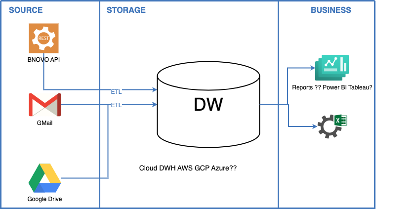
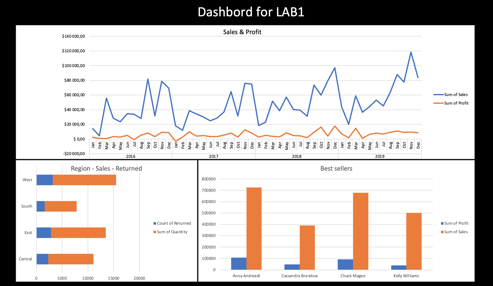

# My lab work 1

## Solution diagram

This is first version of data flows diagram researched for my customers. Now we are choosing technology stack for data streaming (ELT/ETL), DWH and report platform

*[diagram sourse](results/SolutionDiagram_v1.drawio)*

## Dashboard

This is prototype of dashboard on testing data made by excel with used pivot tables and charts base on it

**dashboard source is to big for upload to github**