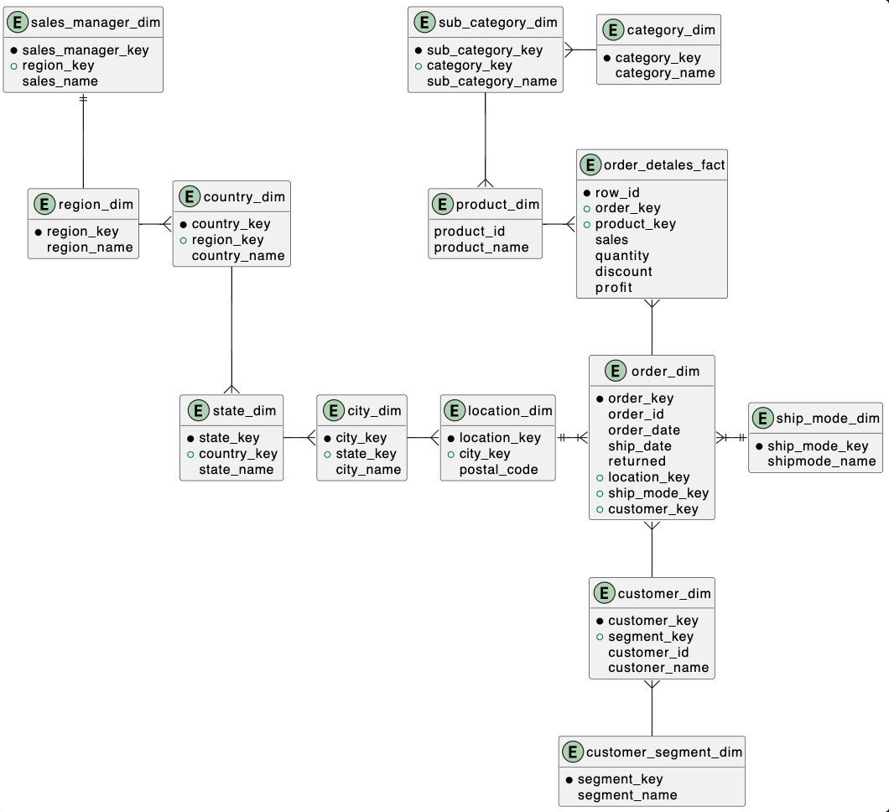
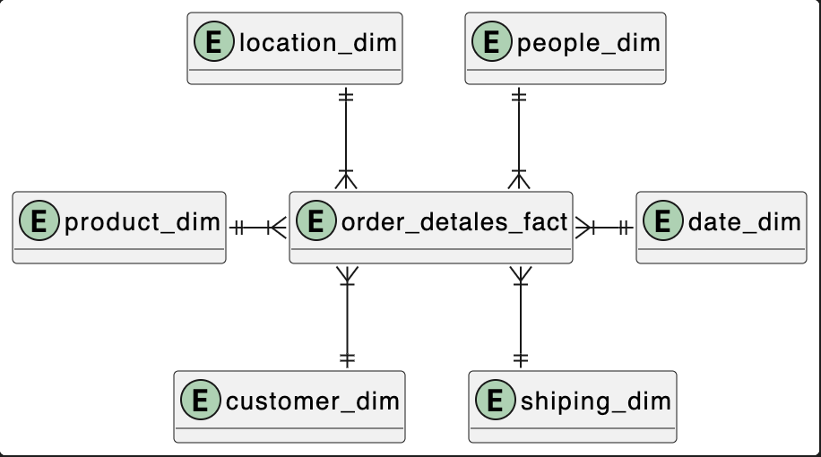
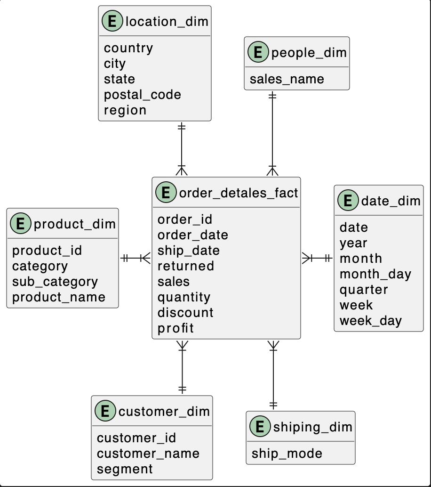
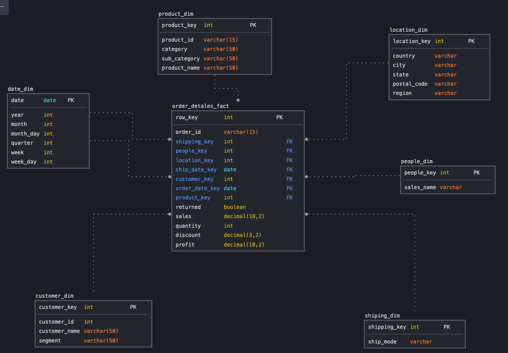
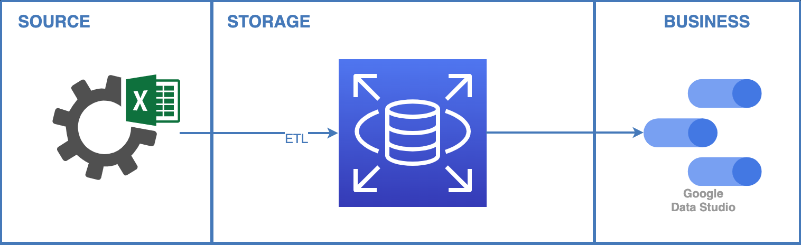
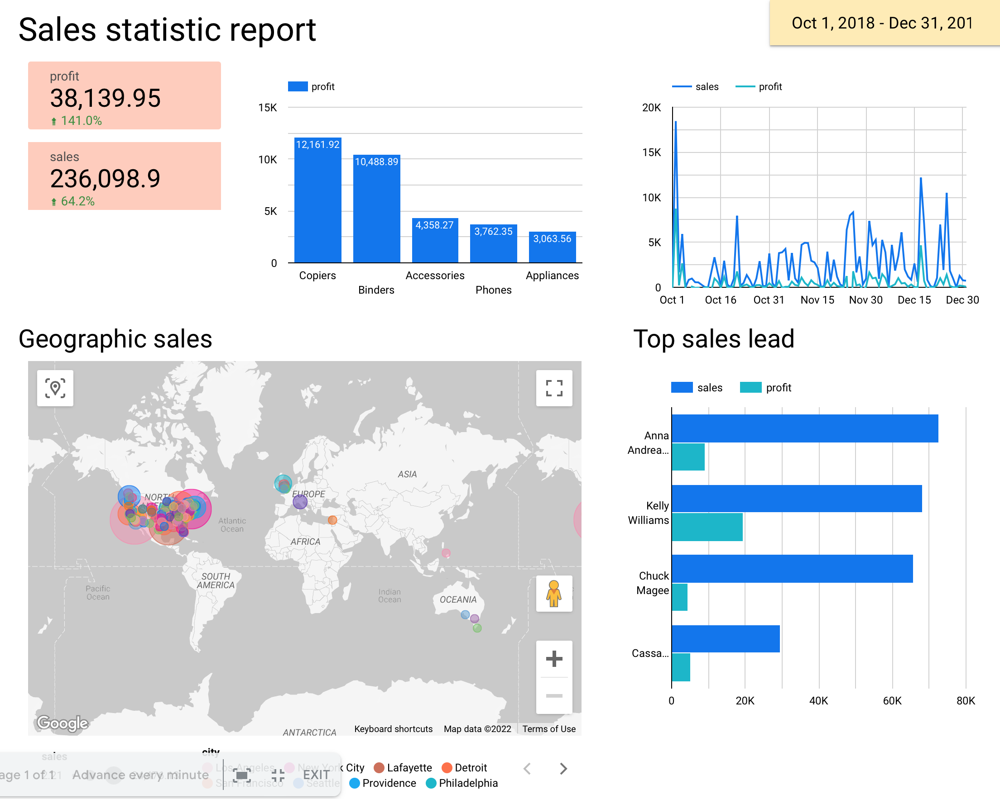

# My lab work 2

## Parth 1 - Modeling

Modeling has been make from xls tables to 3NF and star diagrams

*[Diagrams in PlantUML](results/model.puml)*

### 3NF model

### Conceptual star model

### Logical star model

### Phisical star model
Phisical model was creat by [sqldbm.com](https://sqldbm.com)

## Parth 2 - Development
### Solution diagram

Source is xls file from lab 1
Storage was build on AWS RDS with PostreSQL
Business level is dashboard on Google Data Studio
### Creating data base 

Data base had two levels: Stage and Core. Stage had structure like source file. Core - this is our star model.

For data ETL was developed sql scripts
*[Script ETL Stage -> Core](results/from_stage_to_dwh_full.sql)* 
**xls source is to big for upload to github** 

### Final dashboard

